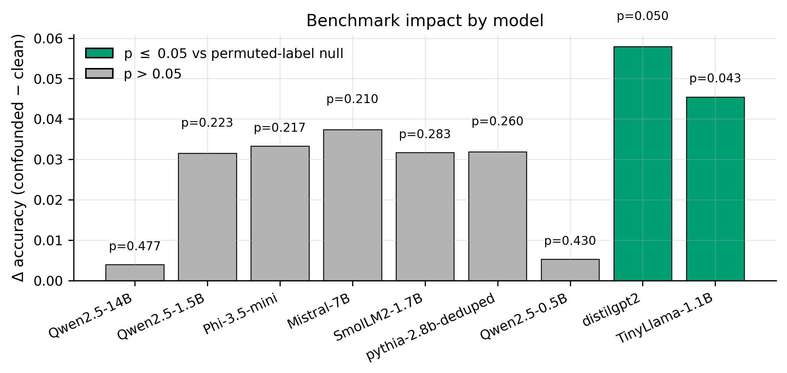

# TruthfulQA Surface-form Confound Audit

An audit of **surface-form asymmetries** in the improved binary-choice [TruthfulQA](https://github.com/sylinrl/TruthfulQA) setting.  
The goal is diagnostic: test whether shallow cues in reference answer pairs are detectable above chance, and whether clean-vs-confounded splits correlate with model performance gaps.



*Top-line visual:* all evaluated models have positive clean-vs-confounded deltas, but only a subset are statistically detectable under a permutation null. This does **not** invalidate TruthfulQA; it motivates subset-aware reporting.

## What This Repository Includes

- Grouped evaluation (`GroupKFold`) with per-pair grouping to avoid within-question leakage.
- Pair-structured null via within-pair label swapping.
- Compact feature ablations and negation ablation.
- Heuristic clean/confounded split diagnostics.
- Optional local model evaluation script for binary-choice predictions.
- Paper-ready figures and LaTeX tables under `paper_assets/`.

## Quick Start

1. Install dependencies:

```bash
pip install -r requirements.txt
```

2. (Optional) regenerate notebook scaffold if you edited the builder:

```bash
python scripts/build_audit_notebook.py
```

3. Run the main notebook:
- `TruthfulQA_Style_Confound_Audit.ipynb`

4. Rebuild paper assets (figures + tables):

```bash
python scripts/make_paper_assets.py --root .
```

## External surface-form audit (FEVER, FeverSymmetric, BoolQ)

Runs the same **claim/question-only** confound methodology (logistic regression, StratifiedKFold, permutation null) on three external sets. **FEVER 1.0** and **FeverSymmetric** rows are **frozen constants** in `scripts/run_fever_audit.py` (no re-download). Each run recomputes **BoolQ** (`google/boolq`, validation split) via HuggingFace `datasets` or a local export. No model inference.

```bash
pip install datasets   # if not already (see requirements.txt)
python scripts/run_fever_audit.py
```

**Local BoolQ** (columns `question`, `answer`): `--boolq-data PATH` or `data/boolq/validation.{parquet,json,jsonl,csv}`.

**Outputs:** `audits/fever_audit_results.csv` (three rows), `paper_assets/tables/cross_dataset_comparison_table.tex`, `paper_assets/tables/boolq_feature_ablation_table.tex`, `paper_assets/figures/fever_audit_auc_comparison.pdf`.

**Options:** `python scripts/run_fever_audit.py --help` (`--seed`, `--n-null`, `--n-boot`, `--boolq-data`).

BoolQ adds feature `question_neg` (mid-question contractions) and omits length-tail confound flags (BoolQ lengths cluster; tails are degenerate).

**Paper framing (BoolQ):** A modest OOF AUC (~0.53), **no dominant ablation group** when removals do not hurt AUC, and a **&lt;1%** heuristic confound rate are consistent with **weak shortcut structure in interrogative surface form** compared with declarative claims (FEVER / TruthfulQA). That contrast is a **substantive positive** for narratives about cross-format robustness, not a failed audit.

## Benchmark-Impact Predictions (Optional)

Use real model predictions in `data/predictions/model_predictions.csv` with schema:
`model_name`, `pair_id`, `correct`.

Example:

```bash
python scripts/run_binary_choice_eval.py \
  --model_name mistralai/Mistral-7B-Instruct-v0.2 \
  --truthfulqa_csv TruthfulQA.csv \
  --output_csv data/predictions/model_predictions.csv \
  --max_examples 200 \
  --seed 42
```

CUDA speed tip:

```bash
python scripts/run_binary_choice_eval.py \
  --model_name Qwen/Qwen2.5-7B-Instruct \
  --truthfulqa_csv TruthfulQA.csv \
  --output_csv data/predictions/model_predictions_qwen2_5_7B.csv \
  --max_examples 100 \
  --seed 42 \
  --device cuda \
  --dtype float16
```

`data/predictions/example_model_predictions.csv` is synthetic demo data for plumbing only (not empirical evidence).
Note: model_predictions_pythia.csv contains real predictions for EleutherAI/pythia-2.8b-deduped, evaluated on Apple Silicon (CPU, float32). This model serves as a contamination-unlikely baseline; its training corpus (The Pile) predates TruthfulQA.
If a model fails to output 'A' or 'B', the response is counted as incorrect (conservative fallback); a warning is printed to stdout for each such case.

## Reproducibility Notes

- Primary data source: [TruthfulQA repository](https://github.com/sylinrl/TruthfulQA) (`TruthfulQA.csv`).
- For stable runs, keep a local copy of `TruthfulQA.csv` and record source date/commit in your experiment notes.
- Grouped-CV and null tests use fixed seeds, but LLM generation can vary by hardware/backend.
- Full run order is documented in `docs/REPRODUCIBILITY.md`.

## Repository Layout

| Path | Purpose |
|------|---------|
| `TruthfulQA_Style_Confound_Audit.ipynb` | Main analysis notebook |
| `scripts/` | All runnable project scripts (`run_fever_audit.py` for FEVER) |
| `data/predictions/` | Model prediction CSVs (real + synthetic demo) |
| `paper_assets/` | Figure and LaTeX assets used in the paper |
| `audits/` | Intermediate and summary CSVs from notebook/script runs |
| `docs/REPRODUCIBILITY.md` | End-to-end reproduction instructions |

## Citation

See `CITATION.cff` for software citation metadata and preferred citation.

## License

MIT. See `LICENSE`.
