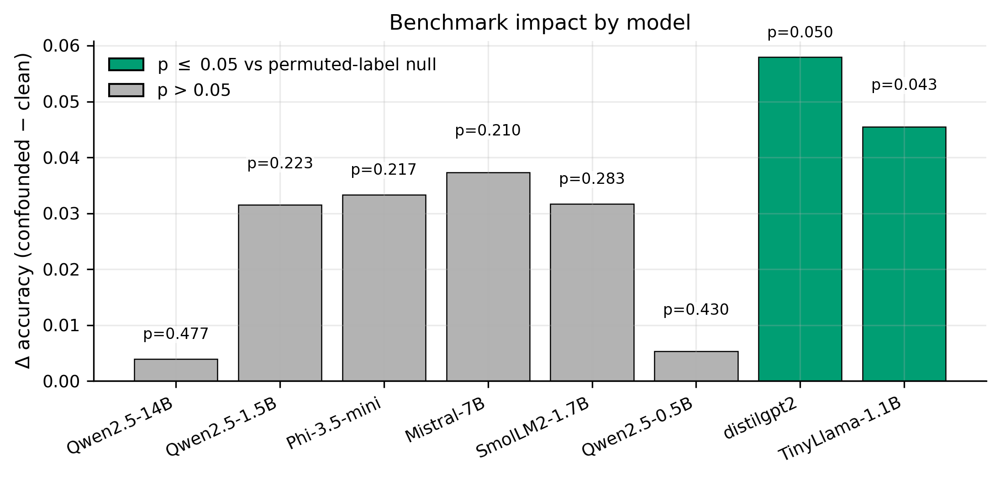

# TruthfulQA Surface-form Confound Audit

An audit of **surface-form asymmetries** in the improved binary-choice [TruthfulQA](https://github.com/sylinrl/TruthfulQA) setting.  
The goal is diagnostic: test whether shallow cues in reference answer pairs are detectable above chance, and whether clean-vs-confounded splits correlate with model performance gaps.



*Top-line visual:* all evaluated models have positive clean-vs-confounded deltas, but only a subset are statistically detectable under a permutation null. This does **not** invalidate TruthfulQA; it motivates subset-aware reporting.

## What This Repository Includes

- Grouped evaluation (`GroupKFold`) with per-pair grouping to avoid within-question leakage.
- Pair-structured null via within-pair label swapping.
- Compact feature ablations and negation ablation.
- Heuristic clean/confounded split diagnostics.
- Optional local model evaluation script for binary-choice predictions.
- Paper-ready figures and LaTeX tables under `paper_assets/`.

## Quick Start

1. Install dependencies:

```bash
pip install -r requirements.txt
```

2. (Optional) regenerate notebook scaffold if you edited the builder:

```bash
python build_audit_notebook.py
```

3. Run the main notebook:
- `TruthfulQA_Style_Confound_Audit.ipynb`

4. Rebuild paper assets (figures + tables):

```bash
python make_paper_assets.py --root .
```

## Benchmark-Impact Predictions (Optional)

Use real model predictions in `model_predictions.csv` with schema:
`model_name`, `pair_id`, `correct`.

Example:

```bash
python run_binary_choice_eval.py \
  --model_name mistralai/Mistral-7B-Instruct-v0.2 \
  --truthfulqa_csv TruthfulQA.csv \
  --output_csv model_predictions.csv \
  --max_examples 200 \
  --seed 42
```

CUDA speed tip:

```bash
python run_binary_choice_eval.py \
  --model_name Qwen/Qwen2.5-7B-Instruct \
  --truthfulqa_csv TruthfulQA.csv \
  --output_csv model_predictions_qwen2_5_7B.csv \
  --max_examples 100 \
  --seed 42 \
  --device cuda \
  --dtype float16
```

`example_model_predictions.csv` is synthetic demo data for plumbing only (not empirical evidence).

## Reproducibility Notes

- Primary data source: [TruthfulQA repository](https://github.com/sylinrl/TruthfulQA) (`TruthfulQA.csv`).
- For stable runs, keep a local copy of `TruthfulQA.csv` and record source date/commit in your experiment notes.
- Grouped-CV and null tests use fixed seeds, but LLM generation can vary by hardware/backend.
- Full run order is documented in `docs/REPRODUCIBILITY.md`.

## Repository Layout

| Path | Purpose |
|------|---------|
| `TruthfulQA_Style_Confound_Audit.ipynb` | Main analysis notebook |
| `build_audit_notebook.py` | Notebook generator |
| `run_binary_choice_eval.py` | Local binary-choice evaluator for model outputs |
| `make_final_tables.py` | Consolidates summary tables from outputs |
| `make_paper_assets.py` | Generates publication-style figures and LaTeX tables |
| `paper_assets/` | Figure and LaTeX assets used in the paper |
| `audits/` | Intermediate and summary CSVs from notebook/script runs |
| `docs/REPRODUCIBILITY.md` | End-to-end reproduction instructions |

## Citation

See `CITATION.cff` for software citation metadata and preferred citation.

## License

MIT. See `LICENSE`.
